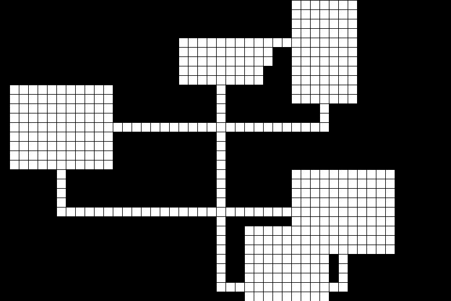
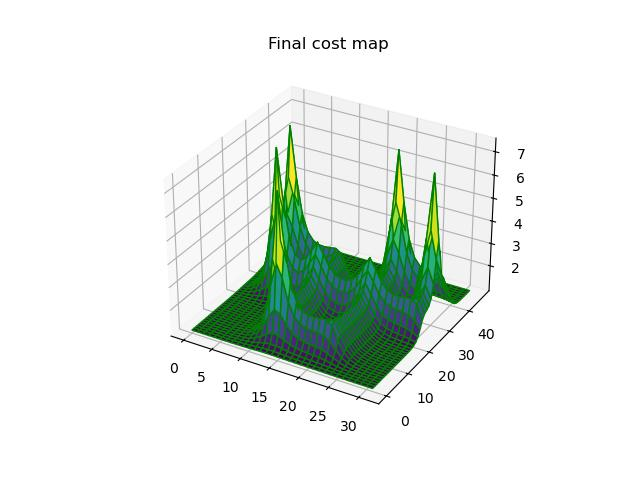

# Random Dungeon Generator
## About
There are a lot of random dungeon generators out there, and it's a fun problem to solve, so I've taken a crack at it.

One of the most important features of a dungeon generator (beside that it successfully generate some kind of dungeon) is what kind of game experience it supports. In this case, I was inspired by my favorite MMO, _Elder Scrolls Online_, and the general structure of its delves: several large rooms arranged in a main loop, which may or may not have many crisscrossing passages. Also, this is meant to be the configurable skeleton of a dungeon generation process. It carves out empty rooms and paths from solid space and returns an image... that's it. Any further development would necessitate more specific requirements about the desired outcome.

To summarize, my objectives were:
- Create an algorithm with adjustable parameters
- Allow variability in room overlap and intersecting hallways
- Guarantee at least the existence of a main loop between all rooms
The algorithm works by maintaining a "cost map" of the dungeon, which it uses to inform placement of other rooms and pathfinding operations. When a room is placed, a cost is added to its center cell, which diminishes logarithmically the farther from that cell you go. As more rooms are placed, cells accrue more cost. Each rooom uses a weighted random selection process to disfavor placing itself in higher-costing cells. Pathfinding operations will then treat the cost map values as movement costs.

Dungeon Map|Cost Map
---|---
    |

## Use
This is a simple script meant to be imported and run locally in Python 3.x.

Required libraries:
- Matplotlib
- Numpy
- Pillow

### Import
`import dungeon_generator`

### Generating a Dungeon
#### Example
```
dg = dungeon_generator.DungeonGenerator()
dg.generate()
```
The `generate` method returns the instance of the `DungeonGenerator`, but it will not create any output. To do that, use the `save_image` method.

#### Documentation
`DungeonGenerator(target_room_count=12, map_width=48, map_height=32, min_room_dim=5, max_room_dim=15)`

Arguments:
- `target_room_count`: `int > 0` representing the desired number of rooms. This number is a "target" because rooms may overlap and become one room, although the algorithm is designed to discourage this. (But hey, variety is the spice of life!)
- `map_width`: `int > 0` determines the width of the map in cells. (See the `save_image` method documentation for more about how to determine the size of the saved image in pixels.)
- `map_height`: `int > 0`, same as map width but it's height.
- `min_room_dim`: `int > 0`, determines the minimum width of a room (before overlapping with other rooms and hallways).
- `max_room_dim`: `int > 0`, determines the maximum width of a room (also before overlap).

### Saving an Image
#### Example
Once the `generate` method has been called, you can save an image of the dungeon map like this:

`dg.save_image()`
#### Documentation
`save_image(image_path='dungeon.jpg', cell_size=16)`

Arguments:
- `image_path`: `str`, relative path and filename at which the image will be saved.
- `cell_size`: `int > 0`, size of each printed cell in pixels.

### Saving the Cost Map
#### Example
An optional feature is to view the final state of the cost map after your dungeon was generated. This just gives you a sense of how the algorithm works.

`dg.save_cost_plot()`
#### Documentation
`save_cost_plot(img_path='cost_plot.jpg')`

Arguments:
- `image_path`: `str`, relative pth and filename at which the image of the cost map as a 3D plot will be saved.